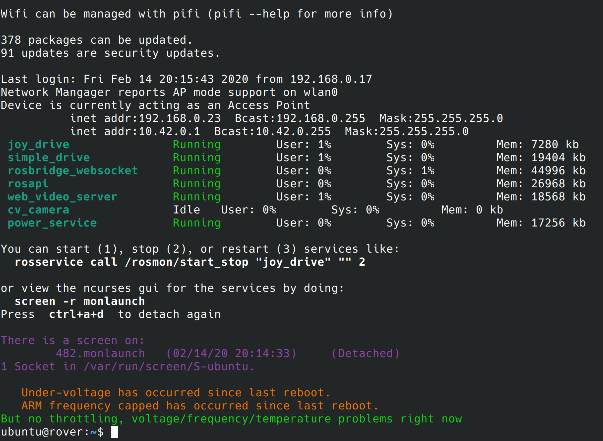
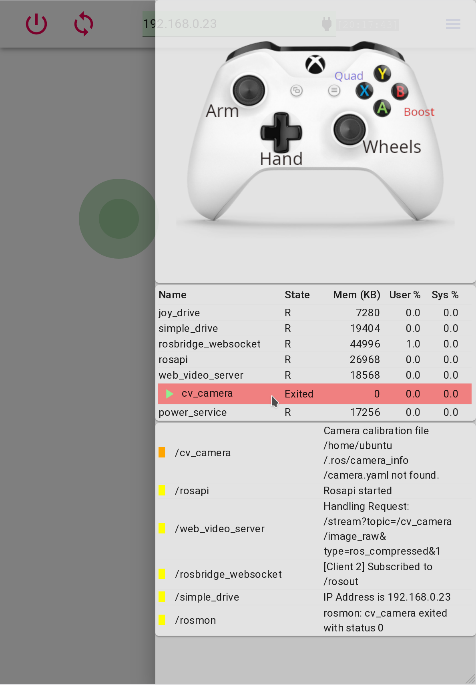

# RobotOSHelpers
Helper scripts for RobotOS (ROS)

These are a few scripts to make it a bit easier to manage and monitor your ROS nodes, from both the
console and from a GUI.

1. Modify the `launch/startup.launch` file to list all the nodes that you want to launch and manage.
2. Modify `launch.sh` and `launch_gui.sh` and `bashrc.bash` to fix the paths for your system.
3. Modify systemctl `startup.service` file to fix the paths for your machine, to run the `launch.sh`,
   and copy it to `/lib/systemd/system`.  You can skip this step if you don't want it to start
   automatically at startup.  Run `sudo systemctl daemon-reload; sudo systemctl enable startup.service`
   to enable it.  Reboot.
4. If you are using a raspberry pi, edit `print_status.py` and uncomment the last line as indicated.
5. You can now run `print_status.py` at any time to see the current status of your nodes.
6. I like to add this to `~/.bashrc` to see the status when I ssh in to my robot:
     `source ~/RobotOSHelpers/bashrc.bash`

Example output:

I like to add this information to whatever GUI I'm creating for my robot.   For example:

Note that I show a start/stop button when hovering over a node process, to let me start and stop the node.

See the `example_react_gui` for the React javascript code to show the process information and show a button to start and stop the process.

